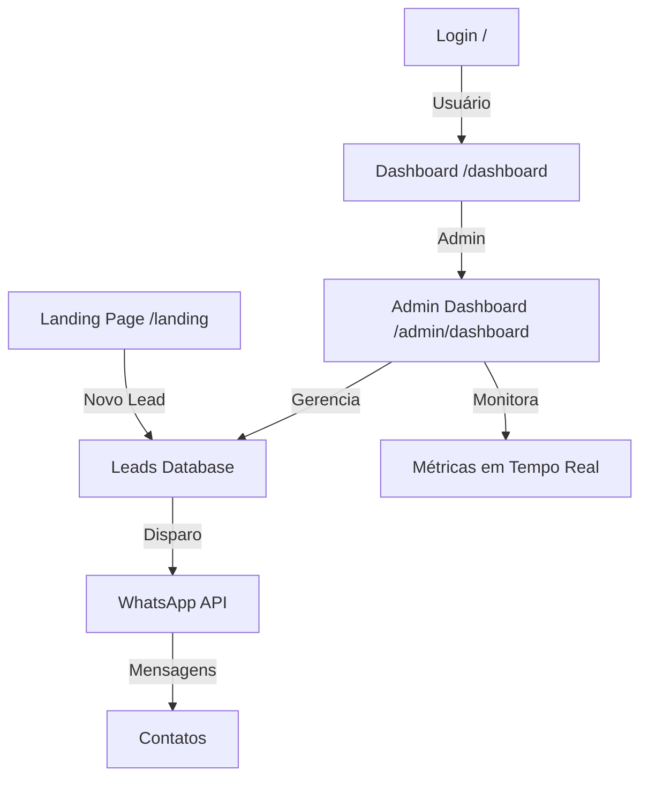

# LeadScrap - Plataforma Enterprise de Disparo WhatsApp em Massa

> **Solução completa de automação de marketing** para disparar mensagens em massa no WhatsApp com aprovação de usuários, dashboard administrativo avançado e métricas em tempo real.

## 📱 O que é LeadScrap?

LeadScrap é uma plataforma SaaS profissional de código aberto que permite:

- ✅ **Disparo em Massa**: Envie campanhas para milhares de contatos simultaneamente
- ✅ **Captura de Leads**: Landing page integrada para capturar novos contatos
- ✅ **Dashboard Inteligente**: Visualize métricas, relatórios e performance em tempo real
- ✅ **Controle Administrativo**: Sistema RBAC com aprovação de usuários
- ✅ **Automação**: Integração com WhatsApp Business (Baileys)
- ✅ **Segurança**: Autenticação com Supabase, encriptação de dados

### 🎯 Arquitetura e Fluxo Principal



## 🏗️ Arquitetura Técnica

### Stack Tecnológico

**Frontend:**
- Next.js 14 (App Router)
- React 18
- Tailwind CSS
- Framer Motion (Animações)
- Socket.IO (Real-time)

**Backend:**
- Express.js (REST API)
- Node.js/TypeScript
- Supabase (PostgreSQL + Auth)
- Baileys (WhatsApp)

**Infraestrutura:**
- Railway (Background Server)
- Puppeteer (Web Scraping)
- PostgreSQL (Dados)

### Estrutura de Pastas

```
disparador/
├── 📁 src/
│   ├── app/                        # Next.js App Router
│   │   ├── page.tsx               # Dashboard login (/)
│   │   ├── layout.tsx             # Layout global
│   │   ├── landing/page.tsx       # Captura de leads (/landing)
│   │   └── admin/                 # Área administrativa
│   │       ├── login/page.tsx     # Admin login
│   │       └── dashboard/page.tsx # Dashboard de leads
│   ├── components/                # Componentes React reutilizáveis
│   ├── services/                  # Serviços (Socket.io, APIs)
│   ├── types/                     # Tipos TypeScript
│   └── utils/                     # Utilitários
├── 📁 server/                     # Backend Node.js
│   ├── index.ts                   # Entry point
│   ├── routes/                    # Rotas (auth, admin)
│   ├── services/                  # Serviços (WhatsApp, Campanhas)
│   └── utils/                     # Utilitários
├── 📁 background-server/          # Servidor background 24/7
│   ├── src/index.ts              # Processamento de campanhas
│   ├── railway.json              # Config Railway
│   └── render.yaml               # Config Render
├── 📁 public/                    # Arquivos estáticos
└── 📁 scripts/                   # Scripts SQL e utilitários
```

## 🚀 Início Rápido

### 1. Instalação

```bash
# Clonar ou copiar projeto
cd disparador

# Instalar dependências
npm install

# Copiar arquivo de ambiente
cp .env.example .env.local
```

### 2. Configurar Supabase

```bash
# 1. Criar projeto em https://supabase.com
# 2. Pegar credenciais e adicionar ao .env.local
# 3. Executar schema SQL em Supabase Studio > SQL Editor
```

### 3. Executar Localmente

```bash
# Terminal 1 - Frontend Next.js
npm run dev

# Terminal 2 - Backend Express
npm run dev  # O script concorrente já inicia ambos

# Acessar:
# - Login Principal: http://localhost:3000
# - Dashboard Principal: http://localhost:3000/dashboard
# - Landing Page: http://localhost:3000/landing
# - Admin Dashboard: http://localhost:3000/admin/dashboard
# - Admin Login (subdomain): http://adminls.localhost:3000/admin/login
```

## 🔐 Sistema de Autenticação

### Login Principal (Dashboard)

1. Usuário faz login na página principal `/`
2. Autenticação via Supabase
3. Redirecionamento para `/dashboard`

### Captura de Leads (Landing Page)

1. Usuário acessa `/landing`
2. Preenche formulário (Nome, Email, WhatsApp)
3. Lead salvo na tabela `landing_leads`
4. Modal instrui contato via WhatsApp

### Gestão de Leads (Admin Dashboard)

1. Admin faz login em `/admin/login` (ou subdomain adminls)
2. Verificação de role='admin' via Supabase
3. Visualiza leads da landing page
4. Atualiza status (pending, contacted, converted, lost)
5. Acesso direto via WhatsApp para cada lead

## 📊 Schema do Banco de Dados

### Tabela `users`
```sql
id              UUID PRIMARY KEY
email           VARCHAR(255) UNIQUE
password_hash   VARCHAR(255)
name            VARCHAR(255)
company         VARCHAR(255)
phone           VARCHAR(20)
role            VARCHAR(50)        -- 'user' | 'admin'
status          VARCHAR(50)        -- 'pending' | 'approved' | 'rejected'
approved_by     UUID REFERENCES users(id)
approved_at     TIMESTAMP
last_access     TIMESTAMP          -- Última vez que acessou
created_at      TIMESTAMP
```

### Tabela `campaigns`
```sql
id              UUID PRIMARY KEY
user_id         UUID REFERENCES users(id)
title           VARCHAR(255)
message         TEXT
status          VARCHAR(50)        -- 'idle' | 'running' | 'paused' | 'completed'
total_contacts  INT
sent_count      INT
error_count     INT
pending_count   INT
created_at      TIMESTAMP
```

### Tabela `contacts`
```sql
id              UUID PRIMARY KEY
campaign_id     UUID REFERENCES campaigns(id)
number          VARCHAR(20)
name            VARCHAR(255)
status          VARCHAR(50)        -- 'pending' | 'sent' | 'error'
sent_at         TIMESTAMP
```

### Tabela `access_logs`
```sql
id              UUID PRIMARY KEY
user_id         UUID REFERENCES users(id)
dashboard       VARCHAR(50)        -- 'main' | 'admin'
ip_address      VARCHAR(50)
user_agent      TEXT
created_at      TIMESTAMP
```

## 📈 Métricas do Admin Dashboard

### Visão Geral
- **Total de Usuários**: COUNT de users com status = 'approved'
- **Pendentes**: COUNT de users com status = 'pending'
- **Disparos Hoje**: SUM de campaigns.sent_count hoje
- **Contatos Hoje**: SUM de campaigns.total_contacts hoje

### Aprovações Pendentes
- Email do usuário
- Nome da empresa
- WhatsApp
- Tempo esperando aprovação (em horas)

### Lista de Usuários
- Email, Nome, Status, Último Acesso
- Filtro por status
- Exportar dados (opcional)

## 🔄 Upload de CSV

### Formato Aceito

```csv
number,name
11988887777,João Silva
11966665555,Maria Santos
```

**Ou com separadores alternativos:**
- Vírgula: `,`
- Ponto e vírgula: `;`
- Tab: `\t`

### Processamento

1. Upload via `POST /api/upload-csv`
2. Validação de formato
3. Sanitização de números
4. Importação para campaign
5. Pronto para disparo

## 💬 Integração WhatsApp

### Baileys Integration

```typescript
// Conectar WhatsApp
await whatsappService.init();

// QR Code é gerado automaticamente
// Escanear com celular
// Pronto para disparar
```

### Disparos

- Suporta variáveis: `{nome}`, `{numero}`
- Delay configurável entre mensagens
- Automação com limites por hora/dia
- Pausa automática para evitar bloqueio

## 🛡️ Segurança

### Autenticação
- Senhas com bcryptjs (hash + salt)
- JWT tokens (Bearer)
- Role-based access control (RBAC)

### Rate Limiting
- IP-based (implementar em produção)
- Por usuário (max uploads/min)

### Dados Sensíveis
- SUPABASE_SERVICE_KEY: Nunca expor publicamente
- Usar variáveis de ambiente
- Sanitizar inputs do usuário

## ⚙️ Servidor de Background

O projeto inclui um servidor de background separado para processar tarefas pesadas de Web Scraping 24/7.

### Funcionalidades
- Processa jobs de scraping do Google Maps
- Escuta jobs via Supabase Realtime
- Salva logs e resultados no Supabase
- Roda independentemente do frontend

### Deploy
Ver [BACKGROUND_SERVER.md](./BACKGROUND_SERVER.md) para instruções completas de deploy no Railway ou Render.

### Quick Start (Local)

```bash
cd background-server
npm install
cp .env.example .env
# Configure SUPABASE_URL e SUPABASE_SERVICE_ROLE_KEY
npm run dev
```

## 🚀 Deploy

Ver [DEPLOYMENT.md](./DEPLOYMENT.md) para instruções completas de deploy na Vercel.

### Quick Deploy - Vercel

```bash
# 1. Push para repositório GitHub
git push origin main

# 2. Conectar em https://vercel.com
# 3. Importar projeto
# 4. Adicionar variáveis de ambiente

# Variáveis necessárias:
NEXT_PUBLIC_SUPABASE_URL=seu_url
NEXT_PUBLIC_SUPABASE_ANON_KEY=sua_chave_anon
SUPABASE_SERVICE_KEY=sua_chave_service

# 5. Deploy
vercel deploy --prod
```

## 🌐 Variáveis de Ambiente

### `.env.local` (Frontend & Backend)

```env
# Supabase
NEXT_PUBLIC_SUPABASE_URL=https://xxxxx.supabase.co
NEXT_PUBLIC_SUPABASE_ANON_KEY=eyJxxx...
SUPABASE_SERVICE_KEY=eyJxxx...

# WhatsApp
WHATSAPP_SESSION_NAME=disparador_session
WHATSAPP_QR_PATH=./auth_info_baileys

# API
API_PORT=3001
SOCKET_PORT=3002
NODE_ENV=development

# Emails (Opcional para notificações)
SMTP_HOST=smtp.gmail.com
SMTP_USER=seu_email@gmail.com
SMTP_PASS=sua_senha_app
```

### `.env.local` (Background Server)

```env
SUPABASE_URL=https://xxxxx.supabase.co
SUPABASE_SERVICE_ROLE_KEY=eyJxxx...
SCRAPER_WORKERS=4
PUPPETEER_TIMEOUT=30000
```

## 📚 Documentação Completa

- [DEPLOYMENT.md](./DEPLOYMENT.md) - Guia completo de deployment
- [BACKGROUND_SERVER.md](./BACKGROUND_SERVER.md) - Setup servidor background
- [TESTING.md](./TESTING.md) - Guia de testes
- [RENDER_ENV_VARS.md](./RENDER_ENV_VARS.md) - Deploy no Render

## 🛠️ Desenvolvimento

### Scripts Disponíveis

```bash
# Desenvolvimento
npm run dev              # Inicia frontend + backend
npm run dev:next        # Apenas frontend
npm run dev:backend     # Apenas backend

# Build
npm run build           # Build Next.js + TypeScript backend
npm run build:next      # Apenas Next.js

# Produção
npm start               # Inicia servidor em produção

# Linting
npm run lint            # ESLint
```

### Estrutura de Componentes

```
src/components/
├── auth/
│   ├── LoginForm.tsx
│   └── RegisterForm.tsx
├── dashboard/
│   ├── LeadsTable.tsx
│   ├── CampaignCard.tsx
│   └── MetricsCard.tsx
├── admin/
│   ├── UserApprovalPanel.tsx
│   ├── StatisticsPanel.tsx
│   └── CampaignMonitor.tsx
├── common/
│   ├── Header.tsx
│   ├── Sidebar.tsx
│   └── Toast.tsx
└── ui/
    ├── Button.tsx
    ├── Modal.tsx
    └── Input.tsx
```

### Serviços

```
src/services/
├── auth.ts          # Supabase Auth
├── socket.ts        # Socket.IO client
├── campaigns.ts     # API de campanhas
└── leads.ts         # API de leads
```

## 🗂️ API Endpoints

### Autenticação

```
POST   /api/auth/register      # Registrar novo usuário
POST   /api/auth/login         # Login
POST   /api/auth/logout        # Logout
GET    /api/auth/me            # Usuário logado
POST   /api/auth/refresh       # Renovar token
```

### Leads

```
GET    /api/leads              # Listar todos os leads
GET    /api/leads/:id          # Detalhes do lead
POST   /api/landing/submit-lead # Novo lead (landing page)
PUT    /api/leads/:id/status   # Atualizar status
DELETE /api/leads/:id          # Deletar lead
```

### Campanhas

```
GET    /api/campaigns          # Listar campanhas
POST   /api/campaigns          # Criar campanha
GET    /api/campaigns/:id      # Detalhes da campanha
PUT    /api/campaigns/:id      # Atualizar campanha
DELETE /api/campaigns/:id      # Deletar campanha
POST   /api/campaigns/:id/send # Iniciar disparo
POST   /api/campaigns/:id/pause# Pausar campanha
POST   /api/upload-csv         # Upload de lista
```

### Gerenciamento de Usuários (Admin)

```
GET    /api/admin/users        # Listar usuários
PUT    /api/admin/users/:id/approve # Aprovar usuário
PUT    /api/admin/users/:id/reject  # Rejeitar usuário
DELETE /api/admin/users/:id    # Deletar usuário
GET    /api/admin/stats        # Estatísticas gerais
```

## 🔗 WebSocket Events (Socket.IO)

```javascript
// Cliente para Servidor
socket.emit('campaign:start', { campaignId })
socket.emit('campaign:pause', { campaignId })
socket.emit('whatsapp:reconnect')

// Servidor para Cliente
socket.on('campaign:progress', { sent, total, percentage })
socket.on('campaign:completed', { campaignId, stats })
socket.on('whatsapp:qr-code', { qrCodeUrl })
socket.on('notification', { type, message })
```

## 🎯 Roadmap

### Phase 1 - ✅ MVP
- [x] Login e autenticação
- [x] Captura de leads
- [x] Admin dashboard
- [x] Disparo via WhatsApp
- [x] Sistema de aprovação

### Phase 2 - 🚧 Em Desenvolvimento
- [ ] Segmentação de leads
- [ ] Templates de mensagens
- [ ] Agendamento de campanhas
- [ ] Relatórios avançados
- [ ] API pública

### Phase 3 - 📋 Planejado
- [ ] Integração com CRM
- [ ] Webhooks
- [ ] Custom branding
- [ ] Multi-tenancy
- [ ] SSO (Google, Microsoft)

## 💡 Recursos Adicionais

### Tutoriais
- [Como fazer setup inicial](./docs/setup.md)
- [Guia de WhatsApp](./docs/whatsapp-setup.md)
- [Troubleshooting comum](./docs/troubleshooting.md)

### Links Úteis
- [Supabase Docs](https://supabase.com/docs)
- [Baileys Documentation](https://github.com/WhiskeySockets/Baileys)
- [Next.js Documentation](https://nextjs.org/docs)

## 📞 Suporte

### Problemas Comuns

**❌ "Google não consegue ler nada"**
- ✅ Adicione `robots.txt` para permitir indexação
- ✅ Melhore metadados em `layout.tsx`
- ✅ Adicione Schema.org JSON-LD
- ✅ Teste com Google Search Console

**❌ WhatsApp não conecta**
- ✅ Verifique `/auth_info_baileys/` permissions
- ✅ Escanear QR code novamente
- ✅ Fazer login em novo celular

**❌ Supabase não conecta**
- ✅ Verifique `.env.local`
- ✅ Teste com `npm run dev`
- ✅ Check Supabase dashboard

## 📄 Licença

MIT - Veja [LICENSE](./LICENSE) para detalhes

## 🤝 Contribuindo

Contribuições são bem-vindas! Por favor:

1. Fork o projeto
2. Crie uma branch para sua feature (`git checkout -b feature/AmazingFeature`)
3. Commit suas mudanças (`git commit -m 'Add some AmazingFeature'`)
4. Push para a branch (`git push origin feature/AmazingFeature`)
5. Abra um Pull Request

## 📞 Contato

- 📧 Email: contato@leadscrap.com
- 🐙 GitHub: [@seu-usuario](https://github.com)
- 💼 LinkedIn: [seu-perfil](https://linkedin.com)

---

<div align="center">

**⭐ Se esse projeto ajudou, considere dar uma star!**

Desenvolvido com ❤️ por [Seu Nome]

</div>

```bash
# 1. Logar no Vercel
vercel login

# 2. Deploy
vercel --prod

# 3. Configurar variáveis de ambiente no Vercel Dashboard
```

## 📞 Contato

**Suporte WhatsApp**: (62) 99246-6109

## 📝 Changelog

### v1.0 (2024-05-24)
- ✅ Sistema de registro com aprovação
- ✅ Admin dashboard com estatísticas
- ✅ Upload de CSV
- ✅ Integração WhatsApp Baileys
- ✅ Métricas em tempo real
- ✅ Deploy ready

## 📄 Licença

Propriedade da ViraWeb - Todos os direitos reservados.

---

**Desenvolvido por**: ViraWeb  
**Última atualização**: 2024-05-24
